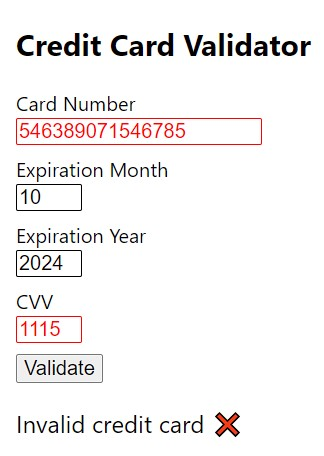

# credit-card-validator

## Running instructions

### Back-end

1. Open `/backend` folder and run `npm install` command
2. Run `npm start` command
3. The API will run on [localhost:5000](http://localhost:5000/)

### Front-end

1. Open `/frontend` folder and run `npm install` command
2. Run `npm start` command
3. The page will run on [localhost:3000](http://localhost:3000/)

## Usage instructions

### Front-end

#### Validate card

1. Write the card number in the "Card Number" field
2. Write the expiration month and year in the "Expiration Month" and "Expiration Year" fields
3. Write the security code in the "CVV" field
4. Click in the "Validate" button to validade the credit card